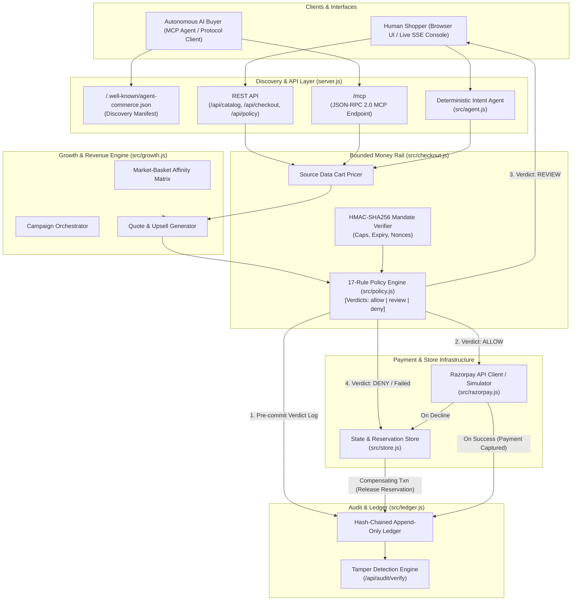
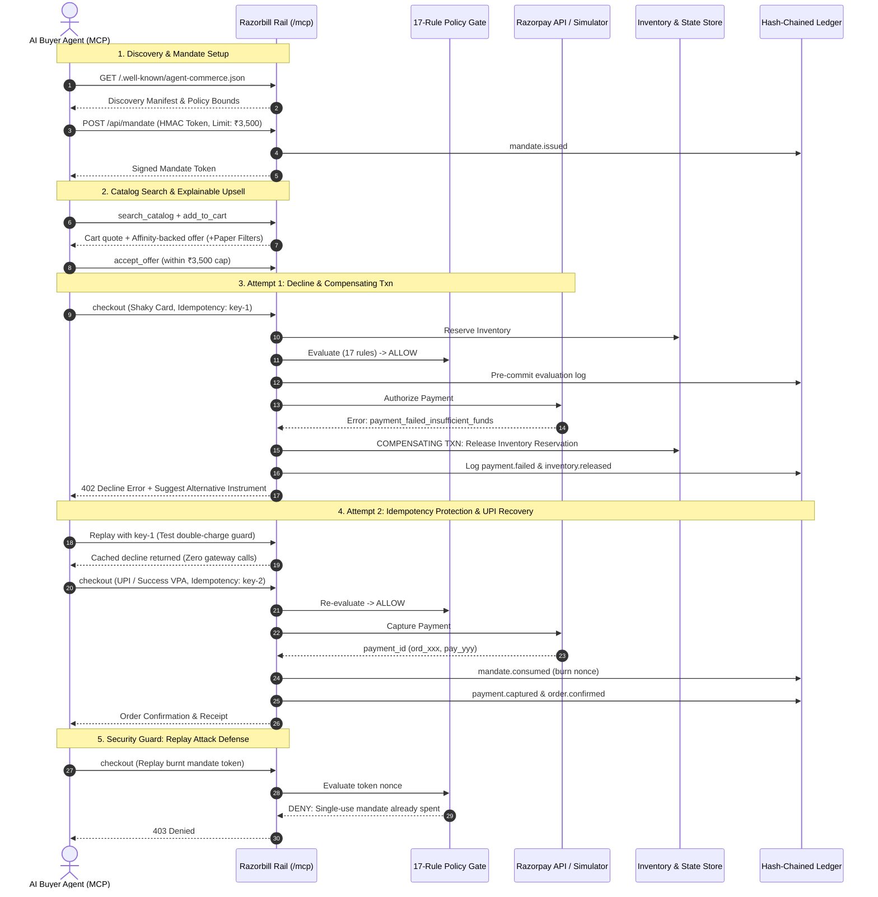

# Razorbill

**An agentic commerce rail for Razorpay merchants.** A merchant that an AI buyer can
discover, negotiate with and pay — where every money action is explainable, bounded,
gated and permanently auditable.

Built for the *AI Growth & Agentic Commerce* brief: grow the merchant's revenue, and make
them sellable to AI buyers.

```
npm start          # http://localhost:3000  — no install step, zero dependencies
npm run buyer      # an external AI buyer transacts over MCP, end to end
npm test           # 68 assertions across every endpoint
```

Node 20+. No npm packages, no API keys, no paid services.

---

## What it does

**Left half of the brief — make the merchant sellable to AI buyers.**
A buying agent that has never heard of this shop can discover it at
`/.well-known/agent-commerce.json`, read the spending policy it will be held to, obtain a
signed mandate, browse a machine-readable catalog over MCP, and pay — without a human and
without scraping a single HTML page.

**Right half — grow revenue.**
A market-basket affinity engine derives co-purchase lift from order history and attaches
evidence to every recommendation. A campaign orchestrator runs bounded incentives. A
replay harness measures what the agent is actually worth.

**The bar — every money action explainable, bounded and gated.**
A 17-rule policy engine returns `allow` / `review` / `deny` with the exact rule and bound
that fired. Nothing charges without that verdict being written to a hash-chained ledger
first. One failure — a card decline — is handled in full, with compensation.

---

## System Architecture



---

## The money rail

Every path obeys the same four steps, in `src/checkout.js`:

1. **Price the cart from source data.** A client-supplied amount is never trusted.
2. **Put the proposed action through the policy engine.**
3. **Write the decision to the ledger _before_ acting on it.**
4. **Act — and if the act fails, run the compensating transaction and log that too.**

### Bounded

Two independent ceilings apply, and the tighter one wins.

| Bound | Value | Behaviour |
|---|---|---|
| Auto-approve limit | ₹5,000 | above this, held for a human |
| Hard cap | ₹25,000 | refused outright; **no approval can override it** |
| Agent daily budget | ₹50,000 | review at 80%, deny at 100% |
| Max agent discount | 15% | plus a post-discount margin floor |
| Velocity | 5 money actions/min | above this, held for review |
| Idempotency | mandatory | no key, no charge |

On top of that sits the **mandate** — the buyer's own signed grant of authority
(`src/policy.js`), carrying a ceiling, an allowed-category list, an item cap, an expiry
and a single-use nonce. It is the answer to *"who said this agent could spend this
money?"*. Signed with HMAC-SHA256 locally; in production the buyer's wallet would sign it
asymmetrically so the merchant never shares a secret.

### Explainable

Every decision returns the full evaluation, including the rules that passed:

```
verdict : deny
summary : Charge ₹4,196.00 exceeds the mandate ceiling of ₹3,500.00.
blocking: mandate.amount_cap  { limit: 350000, actual: 419600 }
trace   : 17 rules, 16 passed
```

The UI renders that trace inline under every payment, and the `agent.turn` ledger entry
records which intent rule fired for each conversational reply. Recommendations are held
to the same standard — an offer carries its lift, confidence and raw co-order count:

> *"Bought together in 71% of Hario V60 orders — 1.8× more often than average."*

### Gated

`review` creates an approval and stops. Nothing is reserved, nothing is charged. When a
human resolves it, policy is **re-evaluated at approval time**, because stock and cart may
have moved while it waited — and a human clearing a hold can never clear a hard deny.

### Audited

`src/ledger.js` is an append-only, hash-chained log. Each entry commits to the hash of the
entry before it, and the digest covers **the entire record** — amount, decision, order id,
actor — not a chosen subset. Editing any historical row invalidates that row and every
hash after it.

Press **Tamper** in the console to rewrite a captured amount in place, exactly as someone
with database access would, and watch `/api/audit/verify` catch it:

```json
{ "ok": false, "broken_at": 17,
  "reason": "content hash mismatch (this entry was altered after it was written)" }
```

> This was a real bug found by the test suite. The first version hashed only
> seq/timestamp/actor/action/payload, leaving `amount_minor` outside the commitment — a
> captured amount could have been rewritten and the chain would still have verified.

---

## The failure, handled gracefully

Pick **Card decline → recover** from the scenario menu, or `npm run buyer`. What happens:

1. Stock is reserved, a Razorpay order and payment link are created.
2. The gateway declines — `payment_failed_insufficient_funds` at `payment_authorization`.
3. **Compensating transaction**: the reservation is released, so nobody else lost that
   stock to a sale that never happened.
4. The cart survives intact. The customer loses nothing.
5. `payment.failed` and `inventory.released` are both written to the ledger with the
   reason code and the gateway's own error envelope.
6. The agent explains it, and offers concrete alternatives.
7. **Retrying the same idempotency key returns the original failure** — no second gateway
   call. Recovery requires a *new* key with a different instrument, which is the correct
   semantic and is what the UI's retry button does.

The distinction matters: a transient gateway timeout is marked `retryable` and *is* safe
to retry on the same key. A bank decline is not, and says so.

---

## Being sellable to an AI buyer

`npm run buyer` runs an external agent that starts knowing only a URL:

```
1. Discover the merchant          /.well-known/agent-commerce.json
2. Read the policy it is bound by get_merchant_profile
3. Mint a mandate                 ₹3,500 ceiling — tighter than the merchant allows
4. Shop against a goal            search_catalog, add_to_cart
5. Weigh the upsell               accepts the consumable, declines what breaks its budget
6. Pay                            declines, replays safely, recovers over UPI
7. Replay the burnt mandate       DENIED — single-use nonce already spent
8. Audit                          chain valid, 6 entries on the order
```

### Protocol & Transaction Lifecycle



The MCP endpoint (`POST /mcp`, JSON-RPC 2.0) exposes ten tools and runs **the same code
paths as the human chat UI**, so a shopper and a machine cannot get different treatment
from the policy engine.

**On the protocol race:** MCP is implemented for real here; the mandate model is aligned
with AP2's intent/cart mandates. The important claim is narrower and more durable — the
authorisation layer is transport-agnostic. ACP, x402, or a UPI/UAP delegated-payment rail
would *bind to the same `evaluate()` gate* rather than replace it.

---

## Razorpay integration, stated honestly

| Mode | When | What is real |
|---|---|---|
| `SIM` | no keys set (default) | nothing hits the network; response and error shapes mirror Razorpay's exactly |
| `TEST` | both keys set | Orders and Payment Links are **genuine Razorpay test-mode API objects**, including a real hosted `short_url` |

```bash
cp .env.example .env      # add rzp_test_… keys, then npm start
```

Card authorisation legitimately cannot happen server-side — it needs the hosted checkout.
So even in `TEST` mode the merchant-side artefacts are real API objects while
authorisation is driven through the simulator, which is what makes both the success and
the failure path reproducible on demand. **The mode is recorded on every ledger entry**
rather than glossed over. Test mode is free and moves no real money.

---

## Why there is no LLM

The conversational agent (`src/agent.js`) is a deterministic intent parser: rule-matched
intents, regex slot extraction, token-overlap product resolution. That is a deliberate
choice, not a shortcut.

- **Zero cost, zero keys.** The whole project runs offline.
- **Every reply is reproducible**, and traceable to the rule that fired — which is what
  you want when the next step spends money.

An LLM slots in at exactly one seam: `classify()`. Everything downstream — policy,
mandates, ledger — is unchanged by that swap, and remains the security boundary
regardless of how good the model is. That is the actual architectural claim: **the gate
does not trust the agent.**

---

## Layout

```
server.js              HTTP router, REST + MCP + SSE
src/
  policy.js            mandates, 17-rule engine, allow/review/deny
  ledger.js            hash-chained append-only audit log
  checkout.js          the money rail: gate, charge, compensate
  razorpay.js          test-mode client + faithful simulator
  growth.js            affinity, offers, campaigns, lift
  agent.js             deterministic conversational agent
  mcp.js               JSON-RPC 2.0 tools + discovery manifest
  catalog.js           products, search, order history
  store.js             sessions, carts, reservations, counters
  demo.js              server-executed autonomous buyer run
public/                two-pane UI: storefront + live merchant console
scripts/
  buyer-agent.js       external AI buyer over MCP
  test-ui-api.js       68 assertions
```

### Try it

Open `http://localhost:3000` and use the **Run a scenario…** menu:

- **Card decline → recover** — the graceful failure, with compensation
- **Over the auto-approve limit** — ₹18,999 held for a human
- **Over the hard cap** — ₹37,998 refused outright
- **Autonomous AI buyer** — the full agent flow, executed live on the server
- **Tamper with the ledger** — break the hash chain and watch it get caught

Or type at the agent: `light roast beans under ₹900` · `add the first one` ·
`what can you spend?` · `checkout` · `audit`.
